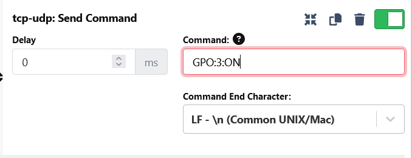

# raspi-gpio

A task that receives udp-commands on port 9091, and switches a GPO according to the message.

## Install

go to homedirectory

```
cd
```

install dependencies

```
curl -fsSL https://deb.nodesource.com/setup_18.x | sudo -E bash -
sudo apt install -y nodejs
sudo apt install git
```

clone repository
git clone https://github.com/marijuste/raspi-gpio.git

enter repository

```
cd raspi-gpio
```

install project dependencies

```
npm install
```

start programm

```
node index.js
```

## Use with companion

Add a generic udp-connection in companion.


Enter the the desired ip of your raspberry and port 9091.


Send following string to switch gpos



| Message | Number | On  | Off | GPIO RASPI |
| ------- | ------ | --- | --- | ---------- |
| GPO     | 1      | ON  | OFF | GPIO24     |
| GPO     | 2      | ON  | OFF | GPIO13     |
| GPO     | 3      | ON  | OFF | GPIO25     |
| GPO     | 4      | ON  | OFF | GPIO23     |
